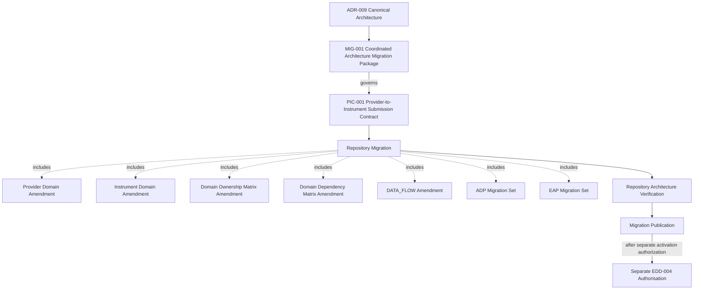

# MIG-001 — ADR-009 Coordinated Architecture Migration Package

**Document ID:** MIG-001
**Title:** ADR-009 Coordinated Architecture Migration Package
**Version:** 0.1
**Status:** Approved
**Canonical Status:** Canonical
**Classification:** Migration Package
**Owner:** Chief Architect
**Prepared By:** Codex Engineering Team
**Review Authority:** Chief Architect
**Repository Location:** `docs/architecture/migrations/MIG-001-ADR-009-COORDINATED-ARCHITECTURE-MIGRATION-PACKAGE.md`
**Workflow Stage:** Draft Preparation
**Governing Architecture:** ADR-009 Version 1.0
**Activation State:** Planning Only
**Migration Execution Authorization:** None
**Implementation Authorization:** None
**Runtime Authority:** None
**Provider Endpoint Invocation Authority:** None
**Persistence Authority:** None
**Provider-to-Instrument Submission Authority:** None
**EDD-004 Drafting Authorization:** None
**Commit Authorization:** None
**Push Authorization:** None

---

# 1. Document Control

## 1.1 Purpose

This document defines the controlled architecture migration programme required to align the Project KRONOS repository with ADR-009 — Provider-Bounded Instrument Master Acquisition Architecture.

It coordinates migration planning only.

It does not execute, activate, implement, or publish the coordinated migration.

## 1.2 Scope

MIG-001 governs:

- identification of architecture affected by ADR-009;
- controlled migration sequencing;
- ownership of migration work;
- dependency ordering;
- validation gates;
- architecture verification;
- coordinated canonical publication planning;
- interruption and rollback governance; and
- objective completion evidence.

## 1.3 Authority

[ADR-009 — Provider-Bounded Instrument Master Acquisition Architecture](../platform/domains/provider/ADR-009-PROVIDER-BOUNDED-INSTRUMENT-MASTER-ACQUISITION-ARCHITECTURE.md) is the governing canonical architecture for this migration package.

Until the coordinated migration is completed and separately activated, existing canonical documents remain authoritative within their current approved boundaries. ADR-009 governs the required migration direction and prohibits incompatible new architectural extension.

MIG-001 shall not reinterpret ADR-009, create replacement architecture, or resolve architecture questions outside the decisions already approved by ADR-009.

## 1.4 Status

This Version 0.1 document is an approved canonical Migration Package.

Its Activation State is Planning Only.

Canonical publication establishes governance authority for migration planning only.

Migration Execution Authorization remains None.

EDD-004 Drafting Authorization remains None.

It grants no:

- coordinated migration execution;
- canonical amendment;
- implementation;
- runtime behaviour;
- endpoint invocation;
- Provider communication;
- live acquisition;
- persistence;
- Provider-to-Instrument submission;
- Instrument interpretation;
- EDD-004 drafting;
- commit; or
- push authority.

## 1.5 Dependencies

MIG-001 depends on:

- canonical ADR-009;
- the existing canonical Provider and Instrument ownership boundaries;
- the Domain Ownership Matrix;
- the Domain Dependency Matrix;
- DATA_FLOW;
- the affected ADP and EAP documents;
- repository governance under GOV-001, GOV-002, and DOC-001; and
- separate Chief Architect authorization for each migration execution stage.

The unresolved platform Provider-to-Instrument Submission Contract is the first new architectural dependency.

The planned identifier for that contract is PIC-001.

MIG-001 governs the coordinated migration dependency on PIC-001 but does not create, draft, approve, or authorize PIC-001.

## 1.6 Related ADRs

- [ADR-007 — Provider Capability Assessment Architecture](../platform/domains/provider/ADR-007-PROVIDER-CAPABILITY-ASSESSMENT-ARCHITECTURE.md)
- [ADR-008 — Provider Entitlement Assessment Architecture](../platform/domains/provider/ADR-008-PROVIDER-ENTITLEMENT-ASSESSMENT-ARCHITECTURE.md)
- [ADR-009 — Provider-Bounded Instrument Master Acquisition Architecture](../platform/domains/provider/ADR-009-PROVIDER-BOUNDED-INSTRUMENT-MASTER-ACQUISITION-ARCHITECTURE.md)

ADR-007 and ADR-008 require no architectural amendment under ADR-009.

## 1.7 Related Domains

- Provider;
- Instrument;
- Observation;
- Market;
- Validation;
- Risk;
- Audit; and
- product architecture for Swing, Intraday, and future products.

Provider retains Provider information, acquisition evidence, Provider Catalogue, Provider dispositions, and Provider provenance.

Instrument retains Instrument interpretation, canonical identity, Provider mapping, cross-Provider reconciliation, relationship meaning, and Instrument lifecycle meaning.

No domain ownership transfers through MIG-001.

## 1.8 Governance Observations

The MIG document family is not currently recognised by DOC-001.

Coordinated migration should introduce MIG as a permanent governed architecture document family instead of using a one-time exception.

No DOC-001 amendment is authorised in this work unit.

# 2. Executive Summary

ADR-009 replaces the product-coupled Instrument Master acquisition direction with a Provider-bounded and dataset-bounded platform architecture governed by:

> Acquire Broadly. Interpret Canonically. Consume Explicitly.

The repository currently contains canonical documents that encode the earlier product-coupled acquisition, admissibility, interpretation, and product-universe boundaries. ADR-009 records these as coordinated migration impacts rather than silently overriding them.

Piecemeal amendment is prohibited because an isolated change could:

- broaden Provider acquisition while retaining product-coupled submission;
- establish a Provider Catalogue without compatible ownership or dependency records;
- remove product constraints from Provider without establishing product-neutral Instrument interpretation;
- create competing Provider-to-Instrument contracts;
- place canonical documents in mutually inconsistent states; or
- imply activation before the complete architecture is coherent.

Repository consistency is mandatory because architecture authority is distributed across domain architecture, contracts, matrices, DATA_FLOW, ADPs, and EAPs. All affected authorities must express one compatible ownership and dependency model before ADR-009 can be activated.

Runtime authority is intentionally excluded. Architecture migration establishes canonical meaning only. It does not authorize endpoint invocation, acquisition, persistence, submission, interpretation, implementation, deployment, or EDD-004.

# 3. Migration Objectives

The migration objectives are:

1. align every affected canonical architecture document with ADR-009;
2. remove product-coupled filtering from Provider Instrument Master acquisition;
3. establish Provider Catalogue as a first-class Provider-owned platform artifact;
4. establish the product-neutral Provider-to-Instrument architectural boundary;
5. preserve Instrument ownership of interpretation, canonical identity, mapping, and cross-Provider reconciliation;
6. preserve explicit Swing, Intraday, and future-product consumption boundaries;
7. preserve Provider, Instrument, Observation, Market, Validation, Risk, and Audit ownership;
8. align the Domain Ownership Matrix and Domain Dependency Matrix;
9. align DATA_FLOW with acquisition, preservation, interpretation, canonical catalogue, and product-consumption stages;
10. replace or amend product-coupled ADP and EAP authority as directed by ADR-009;
11. preserve historical traceability and supersession relationships;
12. prevent partial activation; and
13. produce objective verification evidence before a separate activation decision.

# 4. Migration Principles

## 4.1 Canonical Architecture Before Engineering

Architecture, domain, contract, matrix, and DATA_FLOW alignment shall be canonical before revised engineering architecture is approved.

Engineering shall translate the migrated architecture. It shall not complete missing architecture by inference.

## 4.2 No Partial Activation

No migrated document shall cause ADR-009 activation independently.

Activation requires completion of the full coordinated change set, repository-wide Architecture Verification, coordinated canonical publication, and a separate Chief Architect activation decision.

## 4.3 Repository Consistency

All affected canonical documents shall express compatible terminology, ownership, boundaries, dependencies, authority separation, and non-implications.

## 4.4 Explicit Ownership

Every migration action shall preserve the semantic owner established by canonical architecture.

Document authorship, migration responsibility, or contract production shall not transfer semantic ownership.

## 4.5 Deterministic Migration

Every affected document shall have:

- one migration classification;
- one accountable owner;
- explicit dependencies;
- an approved target meaning;
- required verification evidence; and
- an objective completion state.

## 4.6 Verification Before Activation

Architecture Verification shall occur after all coordinated candidates are complete and before canonical publication.

Repository verification shall occur again after coordinated publication and before activation.

## 4.7 Non-Destructive Traceability

Amendment, replacement, and supersession shall preserve historical versions, review evidence, decision lineage, and canonical predecessor relationships.

## 4.8 Authority Separation

Architecture approval, migration execution, canonical publication, activation, EDD drafting, implementation, endpoint invocation, acquisition, persistence, and runtime authority remain separate.

# 5. Migration Scope

## 5.1 In Scope

- the new platform Provider-to-Instrument Submission Contract;
- Provider Domain Architecture;
- Instrument Domain Architecture;
- bounded clarifications to Observation, Market, Validation, and Risk Domain Architecture;
- Domain Ownership Matrix;
- Domain Dependency Matrix;
- DATA_FLOW;
- ADP-001A through ADP-001J as classified in ADR-009;
- EAP-001 through EAP-006 as classified in ADR-009;
- architecture traceability;
- supersession records;
- repository indexes and navigation required by coordinated canonical publication;
- repository-wide Architecture Verification; and
- coordinated canonical publication planning.

## 5.2 Out of Scope

- runtime behaviour;
- implementation;
- source code;
- tests;
- Provider endpoint invocation;
- Provider communication;
- live acquisition;
- Provider Catalogue persistence implementation;
- storage technology;
- retention implementation;
- deletion;
- Provider-to-Instrument submission execution;
- Instrument interpretation execution;
- engineering implementation;
- EDD drafting;
- EDD-004;
- dependencies;
- deployment;
- scheduling;
- retries;
- product activation; and
- ADR-009 activation.

# 6. Migration Inventory

## 6.1 Classification Definitions

| Classification | Meaning |
|---|---|
| New | A new controlled architecture artifact is required. |
| Major Amendment | The document retains identity but requires material architectural realignment. |
| Minor Amendment | The document retains its core architecture and requires a bounded clarification or alignment. |
| Editorial | Only repository navigation, metadata, or non-semantic traceability alignment is required. |
| No Change | The document remains compatible and requires verification only. |
| Superseded | The current authority must be replaced through governed supersession. |

## 6.2 Inventory Summary

| Classification | Documents |
|---|---|
| New | PIC-001 — Platform Provider-to-Instrument Submission Contract |
| Major Amendment | ADP-001A, ADP-001B, ADP-001I, ADP-001J, Provider Domain Architecture, Instrument Domain Architecture, Domain Ownership Matrix, Domain Dependency Matrix, DATA_FLOW, EAP-003, EAP-004 |
| Minor Amendment | ADP-001D, ADP-001E, Observation Domain Architecture, Market Domain Architecture, Validation Domain Architecture, Risk Domain Architecture, EAP-005, EAP-006 |
| Editorial | Document Register and active repository navigation affected by coordinated publication |
| No Change | ADP-001F, ADP-001G, ADR-007, ADR-008, EAP-001, EDD-001, EDD-002, EDD-003 |
| Superseded | ADP-001C, ADP-001H, EAP-002 |

No classification authorizes the associated amendment or supersession.

## 6.3 Inventory Control

Every item in the detailed Migration Register in Section 13 shall remain `Not Started` until separately authorized.

An item may become `Candidate Complete` only after:

- its dependency conditions are satisfied;
- its approved migration scope is implemented in a controlled candidate;
- its owner completes self-review; and
- its required independent verification evidence exists.

# 7. Dependency Graph

The graph represents required sequencing only.

It grants no execution, publication, activation, or EDD authority.

PIC-001 is governed by MIG-001 and remains uncreated and unauthorized under this migration package.

# 8. Migration Workstreams

## 8.1 WS-01 — Contract Foundation

Purpose:

- define the new product-neutral platform Provider-to-Instrument Submission Contract;
- preserve Provider-owned submission meaning;
- terminate before Instrument interpretation; and
- preserve all ADR-009 submission eligibility and non-implication rules.

Owner: Chief Architect.

Exit dependency: approved canonical contract candidate.

## 8.2 WS-02 — Domain and Platform Authority

Purpose:

- amend Provider Domain Architecture;
- amend Instrument Domain Architecture;
- clarify Observation, Market, Validation, and Risk boundaries;
- align the Domain Ownership Matrix;
- align the Domain Dependency Matrix; and
- align DATA_FLOW.

Owner: Chief Architect.

Dependency: WS-01 contract semantics.

## 8.3 WS-03 — Product Architecture Migration

Purpose:

- amend ADP-001A, ADP-001B, ADP-001I, and ADP-001J;
- supersede ADP-001C and ADP-001H through controlled successors;
- clarify ADP-001D and ADP-001E; and
- verify ADP-001F and ADP-001G remain unchanged.

Owner: Chief Architect.

Dependencies: WS-01 and WS-02.

## 8.4 WS-04 — Engineering Architecture Migration

Purpose:

- supersede EAP-002;
- amend EAP-003 and EAP-004;
- clarify EAP-005 and EAP-006;
- verify EAP-001 remains unchanged; and
- preserve Architecture-to-Engineering traceability.

Owner: Engineering Architect.

Dependencies: completed architecture candidates from WS-01 through WS-03.

## 8.5 WS-05 — Repository Verification

Purpose:

- verify terminology;
- verify ownership;
- verify dependency direction;
- verify contract boundaries;
- verify supersession;
- verify document links and paths;
- verify no conflicting canonical statement remains; and
- verify no unauthorized runtime or engineering authority was introduced.

Owners: Product Master Architect and Engineering Architect within their assigned review authority.

Dependency: all migration candidates complete.

## 8.6 WS-06 — Coordinated Canonical Publication

Purpose:

- publish the approved migration set as one controlled repository change;
- synchronize required indexes and navigation;
- preserve predecessor traceability; and
- verify repository consistency after publication.

Owner: Chief Architect.

Dependency: Chief Architect approval after WS-05.

This workstream does not itself activate ADR-009.

# 9. Validation Gates

| Gate | Entry criteria | Required verification | Exit criteria | Authority effect |
|---|---|---|---|---|
| MG-00 Migration Authorization | MIG-001 approved for the applicable planning or execution stage | Scope, owner, authority exclusions, and inventory confirmed | Explicit Chief Architect authorization for the next bounded workstream | No implementation or runtime authority |
| MG-01 Contract Foundation | ADR-009 canonical; contract drafting separately authorized | Submission eligibility, ownership, exclusions, and Instrument-boundary termination verified | Contract approved as a canonical architecture artifact | No submission execution authority |
| MG-02 Domain Alignment | MG-01 complete; domain amendments authorized | Provider, Instrument, Observation, Market, Validation, Risk, and Audit ownership verified | Domain candidates and matrices mutually consistent | No runtime authority |
| MG-03 ADP Alignment | MG-01 and MG-02 candidates stable | Product acquisition coupling removed; product consumption preserved; supersession traceable | ADP migration candidates complete | No product or Provider activation |
| MG-04 EAP Alignment | Architecture migration candidates approved for engineering translation | Architecture-to-Engineering traceability, contract alignment, and implementation neutrality verified | EAP migration candidates complete | No EDD or implementation authority |
| MG-05 Repository Architecture Verification | Every inventory item is Candidate Complete or verified No Change | Repository-wide terminology, ownership, dependency, boundary, supersession, and authority review | Architecture Verification PASS with no blocking conflicts | Publication may be considered |
| MG-06 Coordinated Publication | Chief Architect approval; MG-05 PASS; publication set fixed | Metadata, identifiers, links, paths, register, Markdown, and repository diff verified | All approved candidates published together and repository consistency confirmed | Architecture published; activation still pending |
| MG-07 Activation Readiness | MG-06 complete | No conflicting canonical architecture; completion criteria satisfied | Separate Chief Architect activation decision may be requested | No automatic activation |

Failure of any gate returns the affected candidate set to the preceding controlled stage.

No gate may be inferred complete from partial document approval.

# 10. Migration Risk Register

| Risk ID | Description | Impact | Mitigation | Owner | Status |
|---|---|---|---|---|---|
| MIG-R001 | Product-coupled acquisition remains in one canonical document | Conflicting acquisition authority | Repository-wide semantic search and document-by-document verification | Chief Architect | Open |
| MIG-R002 | New submission contract overlaps Instrument interpretation | Ownership transfer or duplicate contract | Terminate contract before Instrument interpretation and verify against ADR-009 | Chief Architect | Open |
| MIG-R003 | Provider Catalogue is treated as a cache or canonical Instrument store | Provider and Instrument boundary violation | Preserve first-class Provider artifact definition and prohibited-consumer rules | Chief Architect | Open |
| MIG-R004 | Canonical documents are published piecemeal | Repository enters an internally inconsistent authority state | Freeze publication set and publish only after MG-05 | Chief Architect | Open |
| MIG-R005 | ADP and EAP semantics diverge | Engineering must invent architecture | Complete ADP migration before EAP migration and verify traceability | Engineering Architect | Open |
| MIG-R006 | Superseded documents remain presented as active authority | Competing canonical authority | Record explicit supersession and update controlled navigation atomically | Chief Architect | Open |
| MIG-R007 | Product requirements transfer Validation or Risk ownership | Domain ownership corruption | Verify matrices and domain clarifications against canonical ownership | Chief Architect | Open |
| MIG-R008 | Provider identity or catalogue partitions collide across Providers or datasets | Evidence contamination | Preserve Provider-and-Dataset partition identity and lineage rules | Chief Architect | Open |
| MIG-R009 | Architecture publication is interpreted as runtime authority | Unauthorized Provider activity | Preserve explicit authority separation in every migrated document | Chief Architect | Open |
| MIG-R010 | Migration interruption leaves unreviewed candidates mistaken for authority | Engineering uses non-canonical content | Apply the rollback and authority rules in Section 11 | Chief Architect | Open |
| MIG-R011 | Repository indexes or links do not match published authority | Discoverability and traceability failure | Include index, path, and link checks in MG-06 | Engineering Architect | Open |
| MIG-R012 | EDD-004 begins before activation and authorization | Engineering design proceeds against unstable authority | Retain EDD-004 prohibition through MG-07 and require separate authorization | Chief Architect | Open |

# 11. Rollback Strategy

## 11.1 Authority During Interruption

If migration is interrupted before coordinated canonical publication:

- ADR-009 remains canonical with Activation State Pending Coordinated Migration;
- existing canonical documents remain authoritative within their current approved boundaries;
- migration Drafts and candidates possess no canonical authority;
- no candidate may be used as implementation or runtime authority; and
- no partial migration activation may be inferred.

## 11.2 Candidate Rollback

Before coordinated publication, rollback means returning affected candidates to their prior governance stage while retaining review evidence and change history.

Rollback shall not:

- delete architectural evidence;
- rewrite canonical history;
- remove ADR-009;
- activate predecessor architecture beyond its existing canonical authority; or
- use destructive repository operations to conceal the interrupted migration.

## 11.3 Publication Interruption

The coordinated publication set shall be prepared as one fixed repository change.

If publication integrity cannot be established, publication shall stop before push.

If a published migration set is later found inconsistent, correction requires a separately authorized governed amendment or superseding repository change. Destructive history rewriting is prohibited.

## 11.4 Activation Rollback

MIG-001 does not define runtime or implementation rollback.

Before a separate activation decision, ADR-009 remains activation-pending. No runtime rollback is required because no runtime authority has been granted.

# 12. Completion Criteria

The coordinated architecture migration is complete only when all of the following are objectively established:

1. the platform Provider-to-Instrument Submission Contract is approved and canonical;
2. Provider Domain Architecture reflects Provider-bounded Instrument Master acquisition and Provider Catalogue ownership;
3. Instrument Domain Architecture reflects product-neutral interpretation, canonical identity, and mapping ownership;
4. Observation, Market, Validation, and Risk clarifications preserve their existing ownership;
5. the Domain Ownership Matrix is aligned;
6. the Domain Dependency Matrix is aligned;
7. DATA_FLOW is aligned;
8. every ADP item in the Migration Register is amended, superseded, or verified No Change;
9. every EAP item in the Migration Register is amended, superseded, or verified No Change;
10. all supersession relationships are explicit and traceable;
11. repository navigation and the Document Register identify the published authority correctly;
12. no conflicting product-coupled acquisition authority remains active;
13. no architecture document grants runtime, endpoint, persistence, submission, or implementation authority;
14. repository-wide Architecture Verification returns PASS;
15. Chief Architect approval for coordinated canonical publication is recorded;
16. the complete approved set is published as one controlled repository change;
17. post-publication repository verification returns PASS; and
18. a separate Chief Architect activation decision is recorded.

Completion of Criteria 1 through 17 establishes activation readiness only.

Criterion 18 is required before ADR-009 may cease to be activation-pending.

EDD-004 remains unauthorized until separately approved after activation.

# 13. Migration Register

Completion states are:

- `Not Started`;
- `Authorized`;
- `Drafting`;
- `Candidate Complete`;
- `Verification`;
- `Approved for Coordinated Publication`;
- `Published`; and
- `Verified No Change`.

All entries are `Not Started` under this migration package.

| ID / Authority | Document | Classification | Owner | Rationale | Dependency | Priority | Verification requirement | Completion state |
|---|---|---|---|---|---|---|---|---|
| PIC-001 | Platform Provider-to-Instrument Submission Contract | New | Chief Architect | Establish product-neutral eligible Provider submission boundary before Instrument interpretation | ADR-009 and MIG-001 | P0 | Eligibility, ownership, provenance, exclusions, and boundary termination | Not Started |
| DOMAIN-006 | Provider Domain Architecture | Major Amendment | Chief Architect | Add Provider-wide acquisition, Provider Catalogue, dispositions, partitions, continuity, and product neutrality | New submission contract | P0 | Provider ownership and product-independence review | Not Started |
| DOMAIN-001 | Instrument Domain Architecture | Major Amendment | Chief Architect | Establish product-neutral interpretation, canonical catalogue, identity decision, and mapping ownership | New submission contract | P0 | Instrument ownership and dimensional-model review | Not Started |
| DOMAIN-002 | Observation Domain Architecture | Minor Amendment | Chief Architect | Clarify that product requirements do not change Observation-owned facts | Instrument Domain candidate | P1 | Observation ownership review | Not Started |
| DOMAIN-008 | Market Domain Architecture | Minor Amendment | Chief Architect | Clarify product-supported markets versus Market-owned schedules and state | Product architecture candidates | P1 | Market ownership review | Not Started |
| DOMAIN-003 | Validation Domain Architecture | Minor Amendment | Chief Architect | Preserve Validation-owned Business Judgment | Product architecture candidates | P1 | Validation ownership review | Not Started |
| DOMAIN-007 | Risk Domain Architecture | Minor Amendment | Chief Architect | Preserve Risk Approval and Risk semantics | Product architecture candidates | P1 | Risk ownership review | Not Started |
| Unassigned authority | Domain Ownership Matrix | Major Amendment | Chief Architect | Record Provider Catalogue and explicit product-consumption ownership without transfer | Domain candidates | P0 | Complete ownership consistency review | Not Started |
| Unassigned authority | Domain Dependency Matrix | Major Amendment | Chief Architect | Record platform Provider-to-Instrument support and explicit product consumption | Ownership Matrix candidate | P0 | Dependency-direction and business-pipeline review | Not Started |
| Unassigned authority | DATA_FLOW | Major Amendment | Chief Architect | Add acquisition, Provider preservation, Instrument interpretation, canonical catalogue, and product consumption | Dependency Matrix candidate | P0 | End-to-end flow and ownership review | Not Started |
| ADP-001A | Swing Phase 1 Market Data Inventory | Major Amendment | Chief Architect | Move Instrument Master filtering from Provider acquisition to Swing consumption | Domain and DATA_FLOW candidates | P0 | Product-consumption boundary review | Not Started |
| ADP-001B | Swing Instrument Identity Architecture | Major Amendment | Chief Architect | Make canonical identity product-neutral and separate Swing membership | Instrument Domain candidate | P0 | Identity and product-membership review | Not Started |
| ADP-001C | Provider-to-Instrument Contract | Superseded | Chief Architect | Replace product-bounded submission with the new platform contract | New submission contract | P0 | Supersession and retained product-boundary review | Not Started |
| ADP-001D | Instrument-to-Observation Contract | Minor Amendment | Chief Architect | Clarify product-neutral identity input without Observation activation | Instrument and Observation candidates | P1 | Boundary and non-activation review | Not Started |
| ADP-001E | Observation Domain Architecture | Minor Amendment | Chief Architect | Preserve Observation ownership while allowing explicit product consumption | Observation Domain candidate | P1 | Observation ownership review | Not Started |
| ADP-001F | Runtime Configuration Boundary | No Change | Chief Architect | Configuration ownership remains compatible | ADR-009 | P1 | Confirm no migration dependency or semantic conflict | Not Started |
| ADP-001G | Authentication Boundary | No Change | Chief Architect | Authentication and Provider Context separation remains compatible | ADR-009 | P1 | Confirm Context authority remains bounded | Not Started |
| ADP-001H | Provider Instrument Master Acquisition | Superseded | Chief Architect | Replace product-bounded acquisition scope with ADR-009 Provider-bounded architecture | Provider Domain and new contract | P0 | Supersession, scope, and authority-separation review | Not Started |
| ADP-001I | Approved Instrument Universe and Reference Semantics | Major Amendment | Chief Architect | Recast as Swing product-universe and consumption authority | Instrument Domain and ADP-001B candidates | P0 | Product ownership and reference-semantics review | Not Started |
| ADP-001J | Instrument Interpretation and Canonical Identity | Major Amendment | Chief Architect | Remove product-membership prerequisite and adopt product-neutral dimensional interpretation | Instrument Domain candidate | P0 | Interpretation, identity, and mapping model review | Not Started |
| ADR-007 | Provider Capability Assessment Architecture | No Change | Chief Architect | Provider-scoped capability remains compatible | ADR-009 | P1 | Confirm capability remains separate from authority | Not Started |
| ADR-008 | Provider Entitlement Assessment Architecture | No Change | Chief Architect | Account-scoped entitlement remains compatible | ADR-009 | P1 | Confirm entitlement remains separate from authority | Not Started |
| EAP-001 | Authenticated Provider Context Engineering Architecture | No Change | Engineering Architect | Provider Context remains a shared foundation | Stable architecture set | P1 | Architecture traceability review | Not Started |
| EAP-002 | Provider Instrument Master Acquisition Engineering Architecture | Superseded | Engineering Architect | Replace product-bounded contracts with Provider-wide acquisition and catalogue engineering | Provider Domain, contract, ADP migration | P0 | Full engineering architecture replacement verification | Not Started |
| EAP-003 | Provider-to-Instrument Admissibility Engineering Architecture | Major Amendment | Engineering Architect | Remove product-membership gating and align with platform submission boundary | New contract and ADP migration | P0 | Boundary, ownership, and admissibility review | Not Started |
| EAP-004 | Instrument Interpretation Engineering Architecture | Major Amendment | Engineering Architect | Adopt product-neutral interpretation, identity decision, and mapping dimensions | ADP-001J migration | P0 | Dimensional-model and Instrument ownership review | Not Started |
| EAP-005 | Instrument-to-Observation Attribution Engineering Architecture | Minor Amendment | Engineering Architect | Clarify product-neutral identity input and product-specific Observation requirements | EAP-004 candidate | P1 | Attribution-boundary review | Not Started |
| EAP-006 | Observation Acceptance Engineering Architecture | Minor Amendment | Engineering Architect | Preserve Observation acceptance ownership and explicit product consumption | EAP-005 candidate | P1 | Observation ownership review | Not Started |
| EDD-001 | Provider Access and Provider Context Engineering Design | No Change | Engineering Architect | Provider Context remains compatible and independently governed | ADR-009 | P2 | Confirm no scope or authority change | Not Started |
| EDD-002 | Provider Capability Assessment Engineering Design | No Change | Engineering Architect | Instrument reference capability remains compatible | ADR-007 and ADR-009 | P2 | Confirm no capability reassessment is introduced | Not Started |
| EDD-003 | Provider Entitlement Assessment Engineering Design | No Change | Engineering Architect | Entitlement remains separate and does not filter product scope | ADR-008 and ADR-009 | P2 | Confirm no entitlement migration is introduced | Not Started |
| IDX-001 | KRONOS Document Register | Editorial | Chief Architect Office | Synchronize versions, statuses, supersession, paths, and the migration package during publication | Approved publication set | P0 | Register completeness and path validation | Not Started |
| Active navigation | Repository architecture navigation | Editorial | Chief Architect Office | Expose the coordinated canonical architecture without stale links | Approved publication set | P1 | Link and navigation consistency review | Not Started |

The register is a migration plan, not amendment authority.

No entry may progress without the separately required governance authorization.

# 14. Migration Success Metrics

Migration success shall be determined only through the measurable criteria below.

| Metric ID | Measure | Acceptance threshold | Required evidence |
|---|---|---|---|
| MSM-001 | Migration workstream completion | 6 of 6 workstreams completed with recorded exit evidence | Approved workstream closure records |
| MSM-002 | Migration document completion | 100% of Section 13 entries are `Published` or `Verified No Change`, with no entry in another state | Final Migration Register |
| MSM-003 | Architectural ownership conflicts | 0 unresolved ownership conflicts | Repository Architecture Verification ownership report |
| MSM-004 | Provider responsibility consistency | 0 contradictory Provider responsibilities across the publication set | Provider responsibility comparison report |
| MSM-005 | Instrument responsibility consistency | 0 contradictory Instrument responsibilities across the publication set | Instrument responsibility comparison report |
| MSM-006 | Repository terminology consistency | 0 unresolved contradictory governed terms | Repository terminology verification report |
| MSM-007 | Repository Architecture Verification | Result equals `PASS` with 0 blocking findings | Approved Architecture Verification report |
| MSM-008 | Repository consistency verification | Result equals `PASS`; 0 duplicate identifiers, 0 broken controlled paths, 0 broken local links, and 0 inconsistent lifecycle records in scope | Post-publication repository validation report |
| MSM-009 | Chief Architect approval | Exactly 1 recorded Chief Architect approval covering the fixed coordinated publication set | Approval record identifying the complete publication set |
| MSM-010 | Canonical publication | 100% of the approved publication set is present on the governed branch at the approved versions and canonical states | Publication commit, register evidence, and repository status |
| MSM-011 | Separate activation authorization | Exactly 1 explicit Chief Architect activation decision recorded after MSM-001 through MSM-010 pass | Separate activation approval record |

Migration success is not established if any metric is unmet, unverified, inferred, or supported only by subjective assessment.

Completion of canonical publication shall not itself satisfy MSM-011.

EDD-004 Authorisation remains separate and may be considered only after the separate activation decision and its own Chief Architect authorization.

# End of Document
