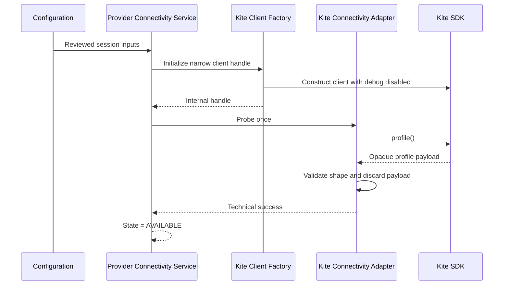
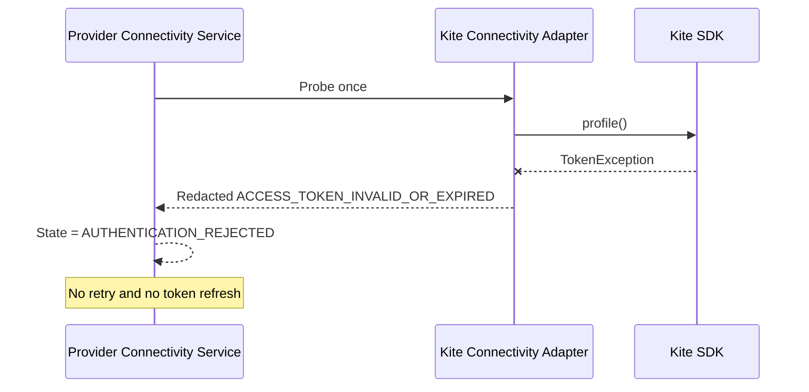

# EP-004 — Minimum Read-Only Kite Connectivity

**Status:** Draft
**Owner:** Engineering Architect
**Architecture authority:** Existing approved Provider and Configuration boundaries
**Approval:** Not approved for implementation until Engineering Architect review
**Date:** 2026-07-22

## Authority and Design Boundary

This Engineering Design Document (EDD) translates the currently permitted EP-004 scope into an implementation proposal. It does not approve architecture, interfaces, dependencies, runtime behavior, or implementation.

The approved [Provider Domain](../../architecture/platform/domains/provider/ARCHITECTURE.md) owns Provider Integration. The approved [Configuration Domain](../../architecture/platform/domains/configuration/ARCHITECTURE.md) owns Runtime Configuration. Their `CONTRACTS.md` files are Draft placeholders and define no concrete approved interface. Consequently:

- this design may describe Provider-internal implementation mechanics;
- this design may consume the existing EP-003 configuration implementation only after Engineering Architect review confirms that use remains inside the approved Runtime Configuration boundary;
- this design does not create or approve a Configuration-to-Provider contract;
- no Provider result may cross into Observation or another domain under EP-004; and
- the Draft research-first assessment, roadmap, and ADR-0001 are constraints supplied by the task, not implementation authority.

## 1. Purpose

EP-004 establishes the minimum durable capability needed to verify authenticated, read-only Zerodha Kite connectivity from inside the Provider boundary.

The capability is a foundation for later, separately approved data-acquisition work. EP-004 does not publish market data, create Market Facts, establish research-data contracts, or authorize EP-005 through EP-010.

## 2. Scope

Subject to the review dependencies in this EDD, EP-004 is limited to:

- consume approved runtime configuration without transferring Configuration ownership to Provider;
- construct a Kite adapter around the repository's installed official Kite Connect SDK;
- consume an already acquired access token to establish an authenticated client session;
- perform one harmless authenticated read-only operation to verify provider connectivity;
- hold a Provider-internal technical availability state;
- map SDK and transport failures to deterministic Provider-owned technical errors;
- redact API keys, API secrets, access tokens, request tokens, authorization headers, and account details;
- provide deterministic initialization, one explicit probe attempt, and shutdown behavior; and
- provide seams for fake clients and factories without allowing SDK types outside the Kite adapter package.

EP-004 does not assume that token refresh exists. Runtime login, request-token exchange, access-token persistence, refresh-token use, browser interaction, and credential automation are outside this design.

## 3. Explicit Non-Goals

EP-004 explicitly excludes:

- order placement;
- order modification;
- order cancellation;
- GTT creation, modification, or deletion;
- basket-order or autoslice-order functionality;
- position conversion or any other position mutation;
- holdings mutation;
- margin mutation or order-margin workflows;
- order, trade, position, or holdings access used as a connectivity shortcut;
- historical-data, quote, LTP, OHLC, instruments, or streaming calls as part of the connectivity probe;
- execution activation or broker-order behavior;
- personal portfolio tracking;
- Market Facts publication;
- historical-data ingestion;
- live market-data streaming or WebSocket use;
- instrument-master ownership;
- Observation creation;
- research dataset persistence;
- provenance or replay implementation;
- opportunity discovery;
- candidate scoring or ranking;
- business interpretation;
- TradingView integration;
- human-decision recording;
- Options execution;
- Event or Audit publication;
- market-open, exchange-schedule, data-completeness, or research-readiness meaning;
- any EP-005 through EP-010 responsibility; and
- a Provider-to-Observation contract.

EP-004 does not modify KR-370, KR-380, KR-390, KR-400, ADR-006, PP-007, Pine behavior, or existing execution semantics.

## 4. Repository and Component Impact

### 4.1 Existing implementation discovered

| Existing path | Current evidence | EP-004 implication |
| --- | --- | --- |
| `pyproject.toml` | Python 3.13 project; `kiteconnect>=5.2.0` and `python-dotenv>=1.2.2` are declared. | No dependency change is required for the design. |
| `uv.lock` | Resolves `kiteconnect` 5.2.0 and `python-dotenv` 1.2.2. | SDK behavior in this EDD was inspected against locked version 5.2.0. |
| `.env.example` | Declares provider, Kite API key, API secret, and redirect URL; no access token. | An access-token input is required before an authenticated runtime probe is implementable. |
| `src/kronos/configuration/settings.py` | Immutable slotted `Settings`; API key and secret are excluded from `repr`; no access token or timeout. | Extend only after review of the Configuration-to-Provider boundary. |
| `src/kronos/configuration/loader.py` | Loads environment values and optional `.env`; no provider call. | Remains the configuration source; must not authenticate. |
| `src/kronos/configuration/exceptions.py` | Defines `ConfigurationError`. | Reuse for invalid or missing configuration at the Configuration boundary. |
| `src/kronos/provider/adapters/kite/__init__.py` | Empty Kite adapter package created by EP-002. | Correct location for SDK-specific implementation. |
| `src/kronos/provider/exceptions/__init__.py` | Empty Provider exception package. | May expose Provider-internal technical error types within Provider only. |
| `src/kronos/provider/models/__init__.py` | Empty Provider model package. | May hold Provider-internal availability values free of SDK types. |
| `src/kronos/provider/services/__init__.py` | Empty Provider service package. | May hold Provider-internal lifecycle orchestration. |
| `src/kronos/provider/contracts/__init__.py` | Empty package. | Must remain unchanged; EP-004 creates no published domain contract. |
| `tests/` | No Python test directory exists. | Test location and runner are engineering decisions requiring review. |
| Composition and commands | No composition root, dependency-injection framework, CLI command, or application bootstrap exists. | EP-004 must not invent an application framework or command merely to host the probe. |

EP-001 through EP-003 are evidenced by commits `bfc1cc3`, `e6631cf`, and `1efac39` and by the current files above. No separate EP engineering-design documents were found.

### 4.2 Required implementation changes after approval

These are proposed implementation paths, not changes made by this EDD.

| Proposed path | Responsibility | Reason | Governing precedent |
| --- | --- | --- | --- |
| `.env.example` | Add an empty, clearly secret access-token variable after its name is reviewed. | The installed SDK requires an access token for authenticated `profile()` use. | EP-003 environment configuration; Configuration ownership. |
| `src/kronos/configuration/settings.py` | Represent the access token as a non-repr secret and validate the minimum Kite session inputs at the approved startup boundary. | Current `Settings` cannot construct an authenticated session. | Existing immutable `Settings`; Configuration owns secrets. |
| `src/kronos/configuration/loader.py` | Load the reviewed access-token variable without logging or transforming its value. | Preserve EP-003 as the only environment-loading boundary. | EP-003 loader. |
| `src/kronos/provider/models/availability.py` | Define Provider-internal availability state and result with no provider payload. | Keep technical availability deterministic and separate from Market Schedule. | Provider owns capability and availability. |
| `src/kronos/provider/exceptions/connectivity.py` | Define redacted Provider technical error categories. | Prevent SDK exception types and messages from escaping the adapter. | Provider isolation and single ownership. |
| `src/kronos/provider/adapters/kite/client.py` | Construct and own the locked SDK client behind a narrow internal handle. | Centralize SDK construction, `debug=False`, timeout, probe, and cleanup. | EP-002 Kite adapter package. |
| `src/kronos/provider/adapters/kite/connectivity.py` | Invoke only the selected read-only probe and map SDK/transport failures. | Keep SDK imports and payloads inside Provider. | Provider adapter boundary. |
| `src/kronos/provider/services/connectivity.py` | Orchestrate initialization, one probe attempt, state transition, and shutdown. | No composition framework exists; a small Provider service is sufficient. | Existing Provider services package; no speculative framework. |
| `tests/unit/configuration/test_kite_connectivity_settings.py` | Verify required values, missing-value behavior, and redaction. | Protect Configuration ownership and secret safety. | Proposed first Python test convention. |
| `tests/unit/provider/test_kite_connectivity.py` | Verify factory, probe, mappings, lifecycle, and no-retry behavior with fakes. | Exercise the Provider boundary without network access. | Existing requirement to mock external dependencies. |
| `tests/boundary/provider/test_provider_boundary.py` | Verify no SDK types, order capability, Market Facts, or cross-domain publication escape Provider. | Make the architecture boundary testable. | CA-015 through CA-017. |
| `tests/integration/provider/test_kite_connectivity_live.py` | Optional, opt-in live smoke test of the same profile probe. | Validate real connectivity without making CI depend on secrets. | Repository evidence-level discipline. |

The proposed test paths establish the smallest clear Python test layout, but the repository has no Python test-runner precedent. The Engineering Architect must approve the runner before implementation; this EDD adds no dependency.

### 4.3 Optional changes requiring review

- A reviewed `KRONOS_KITE_TIMEOUT_SECONDS` setting may replace reliance on the SDK's implicit seven-second default.
- A static source rule may reject direct Kite order-method references in active EP-004 modules if it can distinguish implementation from tests and documentation without brittle false positives.
- A later application composition root may invoke the Provider service, but EP-004 must not create one without an approved application entry point.

### 4.4 Future changes prohibited in EP-004

- Any file under Instrument, Market, Observation, Validation, Risk, Execution, Portfolio, Event, or Audit.
- Any Provider-to-Observation contract or published Provider contract payload.
- Market-data, instrument, historical, streaming, order, holding, position, portfolio, discovery, ranking, persistence, replay, or TradingView module.
- Database, queue, web framework, distributed infrastructure, or background scheduler.
- Pine source, approved architecture, or existing execution-interface changes.

## 5. Component Responsibilities

### Configuration loading

The existing Configuration loader remains the only environment and `.env` reader. It owns missing-value validation and secret-safe representation. It does not construct `KiteConnect`, authenticate, probe, or retain Provider state.

### Kite SDK client factory and handle

The factory is internal to `provider.adapters.kite`. It accepts only the reviewed session inputs, constructs `KiteConnect` with debug output disabled, and returns a narrow internal handle that supports only:

- the selected profile probe; and
- shutdown.

It must not return `KiteConnect`, a generic request method, SDK responses, or order methods.

### Kite connectivity adapter

The adapter invokes the narrow handle, discards the successful profile payload, and converts known SDK or transport failures to Provider technical errors. It creates no Market Fact or business meaning.

### Provider connectivity service

The service owns Provider-internal lifecycle state: initialize, probe once, report internal result, and shut down. It does not expose an application command or cross-domain contract.

### Provider availability result

The result contains only a technical state, a stable internal error category when applicable, and non-sensitive attempt metadata needed for deterministic tests. It contains no SDK object, profile data, account identifier, market schedule, exchange status, data-readiness claim, or research-readiness claim.

### Existing abstractions evaluated

- No provider adapter protocol currently exists.
- No SDK factory currently exists.
- No session-input abstraction currently exists.
- No connectivity probe or Provider availability result currently exists.
- No composition root or dependency-injection mechanism currently exists.
- `Settings` and `ConfigurationError` are reusable, subject to boundary review.
- The empty Provider package structure is the correct extension point.

Only the narrow fake seam required to replace SDK construction in tests is justified. EP-004 must not add generic repositories, gateways, managers, registries, or plugin frameworks.

## 6. Read-Only Enforcement Model

Read-only behavior is guaranteed by KRONOS structure and tests, not by an unsupported assumption about Zerodha account permissions.

1. Only `provider.adapters.kite.client` may import or construct `KiteConnect`.
2. The internal handle exposes only the approved `profile()` connectivity probe and shutdown.
3. No generic `KiteConnect` client, SDK-client getter, or generic request method escapes the adapter.
4. Provider package exports do not re-export SDK types.
5. The active EP-004 surface contains none of the forbidden SDK capabilities enumerated below.
6. Unit tests assert that the fake client receives exactly one profile-probe call and zero other calls.
7. Boundary tests inspect annotations, results, and exported symbols for SDK types and prohibited capability names.
8. Code review includes a scoped search of EP-004 runtime modules for Kite order-method usage.

The forbidden Kite capability surface is:

- order placement, including regular, autoslice, and basket-order workflows;
- order modification;
- order cancellation;
- GTT creation, modification, or deletion;
- position conversion or mutation;
- holdings mutation;
- margin mutation and order-margin or basket-margin workflows;
- order, trade, position, or holdings reads used as a connectivity shortcut;
- historical-data requests;
- quote, LTP, or OHLC requests;
- instruments-list requests; and
- streaming or WebSocket connections.

Only `profile()` is permitted for EP-004 connectivity verification. No other Kite operation may be substituted without a separately reviewed engineering scope.

The official SDK itself includes order methods. Dependency installation therefore cannot provide the read-only guarantee; isolation and reachable-surface control provide it.

## 7. Configuration and Secret Handling

### Configuration trace

| Setting | Current state | EP-004 use | Secret treatment |
| --- | --- | --- | --- |
| `KRONOS_PROVIDER` | Existing; defaults to `KITE`. | Must resolve to the reviewed Kite provider before construction. | Non-secret. |
| `KRONOS_KITE_API_KEY` | Existing; currently may be empty. | Required to construct the authenticated SDK client. | Treat as sensitive credential; redact. |
| `KRONOS_KITE_API_SECRET` | Existing; currently may be empty. | Not consumed by EP-004 runtime because token exchange is out of scope. | Secret; never pass to the probe. |
| `KRONOS_KITE_REDIRECT_URL` | Existing. | Not consumed by EP-004 runtime because interactive login is out of scope. | Configuration value; do not include in routine logs. |
| Access-token environment variable | Missing; proposed name requires review. | Required existing valid session input. | Secret; non-repr, non-loggable, non-persistent. |
| Timeout setting | Missing. | Optional reviewed input; otherwise the effective SDK 5.2.0 default is seven seconds. | Non-secret; exact policy requires review. |

Validation occurs before SDK construction. Missing provider name, API key, access token, or an invalid timeout produces `CONFIGURATION_INVALID` and no network call. API secret and redirect URL are not required for the runtime probe.

Secrets may originate only from Configuration-supported sources. Provider may use secret values transiently to construct the SDK client but does not become their semantic owner. Credentials must not appear in:

- exceptions or chained exception text exposed outside the adapter;
- structured log fields or interpolated messages;
- object `repr` or snapshots;
- test names, parameters, fixtures, recordings, or failure diffs;
- Markdown examples;
- complete request or response payloads; or
- source-controlled `.env` files.

No credential is exposed through a domain contract.

## 8. Authentication and Session Lifecycle

### External or interactive token acquisition

The EP-004 authentication and session ownership assumptions are:

- the access token is acquired externally to the KRONOS EP-004 runtime;
- KRONOS consumes an existing access token through Configuration;
- KRONOS does not own or automate browser login;
- KRONOS does not store a user password or PIN;
- KRONOS does not automate TOTP;
- KRONOS does not perform request-token exchange in EP-004;
- KRONOS does not persist the access token; and
- KRONOS does not refresh or renew the access token.

Kite 5.2.0 provides login URL, request-token exchange, access-token, and refresh-related SDK operations, but EP-004 does not call them. The owner and operating procedure for interactive token acquisition are unresolved operational dependencies.

Any change to these assumptions requires a separately reviewed engineering scope and, if it changes ownership, dependencies, or contracts, architecture review. It must not enter EP-004 as implementation convenience.

### Runtime lifecycle

1. Configuration loads an existing API key and valid access token.
2. Configuration validates presence and safe shape without logging values.
3. The Provider factory constructs `KiteConnect(api_key=..., access_token=..., debug=False, timeout=...)`.
4. The adapter invokes `profile()` once.
5. On success, the returned profile payload is discarded immediately and state becomes `AVAILABLE`.
6. A Kite `TokenException` becomes `ACCESS_TOKEN_INVALID_OR_EXPIRED`; no refresh is attempted.
7. A distinct permission/authentication rejection, when the SDK exposes one without message parsing, becomes `AUTHENTICATION_REJECTED`.
8. Shutdown closes the Provider-owned client handle and transitions to `NOT_INITIALIZED`.

The SDK 5.2.0 client has no public `close()` method. Its internal HTTP session exposes `close()`. Deterministic cleanup therefore requires one reviewed, SDK-isolated compatibility operation in the factory-owned handle. No other module may rely on that SDK internal. An SDK upgrade test must detect if this cleanup path changes.

The design must not parse provider exception messages to infer token expiry, because wording is not a stable contract and may contain sensitive context.

## 9. Connectivity-Verification Flow

### Selected operation

The probe uses `KiteConnect.profile()`. In the locked 5.2.0 SDK this is an authenticated GET of the SDK route `user.profile` (`/user/profile`). It is selected because it:

- proves that the API key/access-token pair can reach an authenticated endpoint;
- does not place, modify, cancel, or read orders;
- does not request holdings, positions, margins, instruments, quotes, historical data, or streaming data;
- creates no Instrument Identity or Market Fact; and
- requires no symbol, market, timeframe, or research-data interpretation.

The profile response contains account information and is therefore sensitive. EP-004 checks only that the SDK completed successfully and returned its expected opaque response shape. It must not inspect business fields, return, persist, snapshot, or log the payload.

### Successful startup and probe



### Invalid or expired token



### Transient network or provider failure

```mermaid
sequenceDiagram
    participant S as Provider Connectivity Service
    participant A as Kite Connectivity Adapter
    participant K as Kite SDK

    S->>A: Probe once
    A->>K: profile()
    K--xA: Timeout, connection, rate limit, or service failure
    A-->>S: Redacted transient technical error
    S-->>S: State = TEMPORARILY_UNAVAILABLE
    Note over S: One attempt in EP-004; operator may invoke a later probe
```

### Graceful shutdown

```mermaid
sequenceDiagram
    participant B as Bootstrap caller
    participant S as Provider Connectivity Service
    participant H as Internal Kite Client Handle

    B->>S: shutdown()
    S->>H: close()
    H-->>S: Resources released or redacted cleanup error
    S-->>S: Clear handle; state = NOT_INITIALIZED
    S-->>B: Deterministic completion
```

## 10. Provider Availability Model

The model is Provider-internal and technical only.

| State | Meaning |
| --- | --- |
| `NOT_INITIALIZED` | No active Provider client handle exists. |
| `AVAILABLE` | The most recent explicit authenticated profile probe succeeded. |
| `CONFIGURATION_INVALID` | Required reviewed configuration was missing or invalid; no probe occurred. |
| `AUTHENTICATION_REJECTED` | The SDK rejected the session or access token. |
| `TEMPORARILY_UNAVAILABLE` | A transient transport, rate-limit, or provider-service failure prevented verification. |

These are the minimum Provider-internal states required by the current design. Unexpected responses, cleanup failures, and adapter defects remain technical error categories; EP-004 does not add speculative availability states for them.

`AVAILABLE` means only that one authenticated read-only call succeeded at a recorded attempt time. None of these states represents Market Schedule, market-open or market-closed status, Market Facts availability, data completeness, historical-acquisition capability, research readiness, or permission to trade.

No cross-domain health or Provider availability contract is introduced.

## 11. Error Model

All public text within Provider is stable and redacted. Original exceptions may be retained only as internal exception causes for diagnostics and must never be serialized or logged by message.

| Category | Source evidence | Retry allowed? | Automatic retry in EP-004 | Log severity | Safe beyond Provider? | Retain cause internally? | Redaction rule |
| --- | --- | --- | --- | --- | --- | --- | --- |
| `CONFIGURATION_INVALID` | Missing/invalid reviewed setting or unsupported provider selection. | No | No | Error | No contract; category is redaction-safe only. | When applicable | Never include values. |
| `AUTHENTICATION_REJECTED` | Permission/auth rejection distinct from token state when exposed structurally by the SDK. | No | No | Warning | No contract; category only. | Yes | Do not log provider message or headers. |
| `ACCESS_TOKEN_INVALID_OR_EXPIRED` | Kite `TokenException`; SDK does not reliably distinguish invalid from expired without unstable message parsing. | No, until a new token is supplied | No | Warning | No contract; category only. | Yes | Never include token or exception message. |
| `NETWORK_TIMEOUT` | Transport timeout. | Yes, on a later explicit probe | No | Warning | No contract; category only. | Yes | Log class/category, not URL query or headers. |
| `CONNECTION_FAILURE` | DNS, connection, TLS, or transport connection failure. | Yes, on a later explicit probe | No | Warning | No contract; category only. | Yes | Exclude proxy credentials and request details. |
| `RATE_LIMITED` | Structured provider/SDK status code 429. | Yes, after operator-reviewed delay | No | Warning | No contract; category only. | Yes | Do not echo response body. |
| `PROVIDER_SERVICE_FAILURE` | Structured provider/SDK 5xx or known service failure. | Yes, on a later explicit probe | No | Error | No contract; category only. | Yes | Do not echo response body. |
| `UNEXPECTED_RESPONSE` | Kite `DataException`, absent expected shape, or malformed SDK result. | No automatically | No | Error | No contract; category only. | Yes | Never log payload. |
| `INTERNAL_ADAPTER_DEFECT` | Unmapped implementation failure or violated invariant. | No | No | Critical | No | Yes | Log stable location/category only; no object dump. |
| `SHUTDOWN_FAILURE` | Client-handle cleanup failed. | No automatic retry | No | Error | No | Yes | Do not dump client/session state. |

Technical failures acquire no business meaning and must not become Market Facts, Market Schedule, Risk Approval, execution state, or Audit Trail records.

## 12. Timeout and Retry Policy

EP-004 performs one network attempt for each explicit probe invocation. It has no automatic retry, background loop, infinite retry, or hidden startup retry. This is a bounded policy with no sleeping and no retry amplification.

- Configuration and authentication failures are permanent for the current inputs and are never retried.
- Timeout, connection, rate-limit, and provider-service failures are marked retryable only for a later explicit operator/application invocation.
- Unexpected responses and adapter defects require review before retry.
- Tests use fakes and do not sleep in real time.

The installed SDK default timeout is seven seconds, but reliance on an implicit dependency default is not a durable KRONOS policy. Before implementation approval, the Engineering Architect must either:

1. approve an explicit Configuration-owned timeout value and validation rule; or
2. explicitly accept the locked SDK default for EP-004 and record its upgrade implications.

No timeout or retry count is invented by this Draft.

## 13. Logging, Observability, and Audit Boundary

Provider emits structured technical logs for:

- adapter initialization started/completed;
- connectivity attempt started;
- connectivity attempt succeeded;
- categorized connectivity failure;
- shutdown started/completed; and
- categorized shutdown failure.

Permitted fields are stable event name, Provider identifier (`KITE`), internal state, redacted error category, attempt ordinal, and duration. Duration is diagnostic only and must not become market or research readiness.

Logs must exclude:

- API key, API secret, access token, request token, and authorization headers;
- complete URLs when credentials or tokens could be present;
- SDK debug output;
- exception message text unless a reviewed sanitizer proves it safe;
- complete request or response payloads;
- user ID, account name, broker, email, phone, exchanges, products, order types, or other profile fields; and
- holdings, positions, margins, order, instrument, quote, historical, or market-data content.

The SDK factory must force `debug=False`. SDK 5.2.0 debug logging includes request headers and response content, so debug mode is prohibited rather than merely discouraged.

EP-004 logs are operational observability. They are not Platform Events or an Audit Trail, and no Event or Audit interface is called.

## 14. Dependency and SDK Isolation

- Official dependency: `kiteconnect>=5.2.0` in `pyproject.toml`.
- Locked version inspected: `kiteconnect` 5.2.0 in `uv.lock`.
- EP-004 does not add or upgrade dependencies.
- Any SDK upgrade requires review of the manifest and lock diff, release notes, profile behavior, exception mapping, debug behavior, timeout behavior, and cleanup compatibility.
- Only `src/kronos/provider/adapters/kite/` imports `kiteconnect` or SDK exception types.
- Provider services, Provider models, Configuration, other domains, and tests outside adapter-specific tests use KRONOS-owned technical types or fakes.
- Fake handles implement only profile-probe and close behavior; they do not import SDK types.
- SDK payloads are discarded inside the adapter.
- Transport exceptions are translated before reaching the Provider service.

The current `>=5.2.0` declaration permits a newer resolution if the lock is deliberately refreshed. The committed `uv.lock` is therefore the reproducibility control; dependency updates must not be incidental.

## 15. Security Considerations

### Design-enforced guarantees

- SDK construction and use remain inside Provider.
- The reachable client surface has no order operation.
- SDK debug mode is always disabled.
- Profile payloads are discarded and never returned.
- Secret fields are excluded from representation and logs.
- EP-004 creates no credential store, token cache, browser automation, refresh workflow, database, WebSocket, or external listener.
- One explicit attempt prevents automatic retry amplification.

### Procedural controls

- Developers use `.env` or another Configuration-supported local source; `.env` is already ignored.
- `.env.example` contains names and empty values only.
- Test fixtures use obvious fake values and never copy real credentials.
- Live tests are opt-in, skip when secrets are absent, and run only in an approved secure environment.
- Reviewers inspect log calls, exception chaining, snapshots, and test failure output for secret exposure.
- Dependency changes are reviewed through `pyproject.toml` and `uv.lock` together.
- A scoped prohibited-method search supplements, but does not replace, API-surface tests and review.

The design does not claim that Zerodha credentials are read-only. KRONOS limits what its implementation can reach.

## 16. Test Strategy

The repository has no Python test framework, Python test directory, or CI convention. `docs/validation/TESTING.md` is canonical for Pine/TradingView evidence and is not a Python test-runner specification. The Engineering Architect must approve the Python runner before implementation. No test dependency is selected by this Draft.

### Unit tests

- valid reviewed configuration produces safe session inputs;
- missing provider, API key, access token, or invalid timeout fails before SDK construction;
- `Settings` and all errors redact secrets;
- factory construction uses `debug=False` and the reviewed timeout;
- fake-factory construction succeeds without importing SDK types into service tests;
- successful profile probe produces `AVAILABLE` and discards payload;
- authentication rejection mapping;
- invalid/expired token mapping;
- timeout mapping;
- DNS/connection mapping;
- rate-limit mapping;
- provider-service mapping;
- unexpected-response mapping;
- unknown defect mapping;
- one attempt only for all categories;
- no retry for permanent failures;
- no real-time sleep;
- repeated initialization and shutdown are deterministic; and
- cleanup failure produces a redacted technical result without retaining an active handle.

### Contract and boundary tests

- no SDK type appears in Provider service/model signatures or exported package symbols;
- no Provider-to-Observation publication exists;
- no order capability appears in the narrow handle or service surface;
- Configuration supplies values without Provider reading environment variables directly;
- Provider does not receive API secret or redirect URL for the runtime probe;
- Provider availability does not claim Market Schedule, Market Facts, data completeness, or research readiness;
- no Event, Audit, Instrument, Observation, Validation, Risk, Execution, Portfolio, or TradingView import is introduced; and
- `provider/contracts/__init__.py` remains unchanged.

### Live integration test

The live smoke test is explicitly opt-in and excluded from normal CI unless a secure secret facility and policy are later approved. It:

- runs only when an explicit opt-in flag and required credentials are present;
- otherwise skips safely without printing which secret was absent;
- performs only `profile()`;
- discards the response;
- never invokes orders, holdings, positions, margins, instruments, quotes, historical data, or streaming;
- prints only pass/fail and a redacted category; and
- distinguishes Provider rejection from test-harness failure.

### Static and repository checks

- `git diff --check`;
- import-boundary check for `kiteconnect` outside `provider/adapters/kite`;
- scoped search for prohibited Kite order methods in EP-004 runtime modules;
- assertion that no runtime file outside Provider/Configuration changed;
- assertion that no approved architecture file changed; and
- Markdown link validation for this EDD.

An automated prohibited-method check should be added only if it parses the relevant source scope or otherwise avoids matching documentation and test names. A brittle repository-wide text ban is not required.

## 17. Acceptance Criteria

EP-004 implementation is complete only when:

- Engineering Architect has approved the design and resolved the Configuration boundary, access-token input name, timeout policy, cleanup approach, and Python test runner;
- approved configuration can construct the Provider adapter without Provider reading environment variables;
- a valid Kite session completes exactly one `profile()` probe;
- profile data is discarded inside the Kite adapter;
- missing/invalid configuration and invalid/expired session state produce deterministic redacted technical errors;
- transient failures produce `TEMPORARILY_UNAVAILABLE` under the one-attempt policy;
- shutdown deterministically clears the handle and state;
- no SDK object or exception leaves `provider.adapters.kite`;
- no Market Fact, Instrument Identity, Market Schedule, Platform Event, or Audit Trail is published;
- no persistent dataset is created;
- no Observation, Validation, Discovery, Risk, Execution, Portfolio, or TradingView path is activated;
- no order operation is reachable through the EP-004 surface;
- unit, boundary, and approved opt-in integration tests pass at their truthful evidence levels;
- documentation matches the implemented behavior;
- no approved architecture file is changed; and
- dependency manifests remain unchanged unless a separately reviewed test-runner decision requires an explicit addition.

Session refresh is not an acceptance criterion.

## 18. Implementation Sequence

Each slice must be independently reviewable.

1. Confirm the Configuration-to-Provider use of existing `Settings`, approve the access-token setting name, timeout policy, test runner, and client cleanup approach.
2. Extend Configuration with the reviewed, redacted access-token input and pre-construction validation; add tests.
3. Add the narrow Kite client factory/handle with `debug=False`; test that no generic SDK client escapes.
4. Add the profile-only adapter and successful probe path; discard the payload.
5. Add Provider-internal availability state and service lifecycle.
6. Add deterministic error mapping with original causes retained internally and messages redacted.
7. Add structured technical logging with secret-leak tests.
8. Add unit and boundary tests for prohibited capabilities and domain imports.
9. Add the opt-in live profile smoke test only after secure operational setup is approved.
10. Run dependency, link, diff, architecture-scope, and prohibited-capability checks; reconcile documentation with actual behavior.

No slice may introduce an application framework, automatic retry loop, token acquisition, market data, published contract, or order capability.

## 19. Risks and Mitigations

| Risk | Mitigation |
| --- | --- |
| SDK object or exception leakage | Single adapter import boundary, KRONOS-owned result/errors, boundary tests. |
| Accidental order-method exposure | Profile-only handle, no generic client getter, prohibited-surface tests and review search. |
| Credential or profile leakage | Non-repr secrets, debug disabled, stable redacted logs, payload discard, fake fixtures. |
| Unsupported token-refresh assumption | Runtime consumes an existing token; token acquisition and refresh remain external/unresolved. |
| Probe becomes a market-data contract | Use profile only; discard payload; no Observation or contracts package change. |
| Profile probe leaks personal information | Never return, persist, inspect business fields, snapshot, or log response data. |
| Retry amplification or rate-limit pressure | One attempt per explicit invocation; no automatic retry or background loop. |
| Live-test flakiness | Opt-in only, truthful failure category, excluded from normal CI. |
| Configuration coupling | Use existing loader/Settings only after boundary review; Provider never reads environment directly. |
| SDK cleanup relies on an internal | Isolate the compatibility operation in one factory handle and gate upgrades with tests. |
| Premature abstraction | Add only one fake seam, one adapter, one service, one result model, and error categories. |
| Implementation assigns unresolved ownership | Stop at Provider-internal availability; no Provider-to-Observation, Audit, Event, or Discovery path. |

## 20. Open Questions and Blockers

### Architecture blockers

- The approved domain documents name Provider Integration and Runtime Configuration contracts, but both domain `CONTRACTS.md` files are Draft placeholders. Engineering needs confirmation that EP-004 may consume the existing `Settings` implementation without creating an unapproved cross-domain contract.
- Publishing Provider availability beyond Provider is blocked until an approved consumer and concrete interface exist. This EDD keeps it internal.
- Provider-to-Observation acquisition, Market Facts publication, persistence, provenance, replay, and all EP-006-plus work remain blocked by the gaps recorded in the Draft impact assessment and roadmap.

### Engineering decisions requiring review

- Exact environment-variable name for the existing valid Kite access token; `KRONOS_KITE_ACCESS_TOKEN` is a naming candidate, not approved by this Draft.
- Whether EP-004 uses an explicit Configuration-owned timeout or explicitly accepts the locked SDK's seven-second default.
- Python test runner and the first repository-wide Python test-location convention.
- Whether deterministic cleanup may use the isolated SDK 5.2.0 HTTP-session compatibility path, given the lack of a public SDK `close()` method.
- Whether the optional live smoke test belongs in this EP or in a separate operational validation task.
- Whether a robust static source check provides enough value beyond API-surface tests and scoped review.

The unresolved access-token environment-variable name and timeout value are engineering review decisions, not architecture decisions. Their selection must preserve the approved Configuration and Provider ownership boundaries.

### Operational setup requirements

- A Zerodha Kite application and API key managed outside source control.
- An externally acquired current access token supplied through an approved Configuration source.
- A documented human operating procedure for replacing an expired token; no runtime refresh is designed.
- An approved secure environment for opt-in live tests.
- A prohibition on real credentials in commits, screenshots, logs, fixtures, CI output, or support artefacts.

Successful EP-004 connectivity does not unblock later acquisition or research work by itself.

## 21. Definition of Done

- [ ] Engineering Architect review completed; EDD remains Draft until explicitly approved.
- [ ] Architecture and engineering blockers are resolved or the implementation is constrained around them.
- [ ] Existing valid-token input and timeout behavior are explicitly reviewed.
- [ ] SDK is isolated to `provider.adapters.kite`.
- [ ] Only the profile probe is reachable.
- [ ] Provider-internal availability and technical errors are deterministic and redacted.
- [ ] No automatic retry, login automation, refresh, market data, persistence, contract publication, or order operation exists.
- [ ] Unit and boundary tests pass under the approved Python test convention.
- [ ] Optional live smoke evidence is reported separately and truthfully.
- [ ] Secrets and profile data do not appear in logs, exceptions, snapshots, fixtures, or diffs.
- [ ] `git diff --check`, Markdown-link validation, dependency review, and prohibited-capability checks pass.
- [ ] No approved architecture, Pine, unrelated runtime, or EP-005 through EP-010 file changed.
- [ ] Implementation documentation matches the delivered surface.

## Related Repository Authority

- [PLATFORM-000 — KRONOS Platform Constitution](../../architecture/platform/PLATFORM-000-CONSTITUTION.md)
- [KRONOS Platform Overview](../../architecture/platform/PLATFORM_OVERVIEW.md)
- [Domain Ownership Matrix](../../architecture/platform/DOMAIN_OWNERSHIP_MATRIX.md)
- [Domain Dependency Matrix](../../architecture/platform/DOMAIN_DEPENDENCY_MATRIX.md)
- [Provider Domain](../../architecture/platform/domains/provider/ARCHITECTURE.md)
- [Configuration Domain](../../architecture/platform/domains/configuration/ARCHITECTURE.md)
- [Engineering Manual](../../KRONOS_ENGINEERING_MANUAL.md)
- [Research-First Architecture Impact Assessment](../../architecture/products/discovery/RESEARCH_FIRST_ARCHITECTURE_IMPACT_ASSESSMENT.md)
- [Research-First Engineering Roadmap](../../architecture/products/discovery/RESEARCH_FIRST_ENGINEERING_ROADMAP.md)
- [Draft ADR-0001](../../architecture/adr/ADR-0001-research-first-product-mandate.md)
